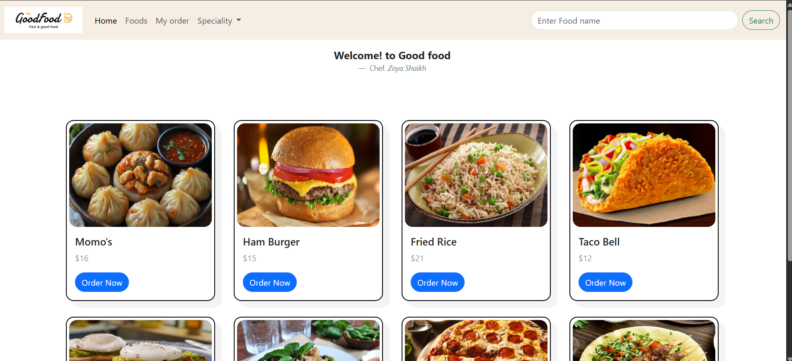

# Restaurant Landing Page

 
> A clean and responsive landing page for a restaurant, designed to showcase a food menu using a modern card-based layout.
> This project was built with HTML, CSS, and the Bootstrap 5 framework.

**Live Demo:** [Link to your live project here] 
---

## 🚀 Project Overview

This project is a static webpage for a fictional restaurant called "Good Food." 
The goal was to create a visually appealing and user-friendly menu display using a combination of the Bootstrap 5 framework and custom CSS for unique styling. 
The design is fully responsive and focuses on a clean layout and reusable card components.

## ✨ Features

* **Responsive Navigation Bar:** A fully responsive, fixed-top navigation bar with a logo, navigation links, a dropdown menu for "Speciality" items, and a search bar. It collapses neatly on smaller screens with a hamburger menu.
* **Dynamic Card Layout:** A flexible grid of food items that wraps on different screen sizes, created using modern CSS Flexbox.
* **Styled Menu Cards:** Custom-styled cards with box-shadows and interactive hover effects to display food items, their prices, and an "Order Now" button.
* **Bootstrap 5 Integration:** Leverages the Bootstrap framework for its robust grid system, responsive components (navbar, cards, buttons), and utility classes.
* **Custom Styling:** Includes a separate stylesheet to override and enhance the default Bootstrap look, applying custom fonts (Poppins), colors, and `border-radius` for a unique design.

## 🛠️ Technologies Used

* **HTML5:** For the structure and content of the webpage.
* **CSS3:** For all custom styling, including Flexbox for layout, box-shadows, and hover transitions.
* **Bootstrap 5:** For the core responsive framework and pre-styled components.
* **Google Fonts:** For importing the "Poppins" and "DM Serif Text" font families for a clean, modern aesthetic.
